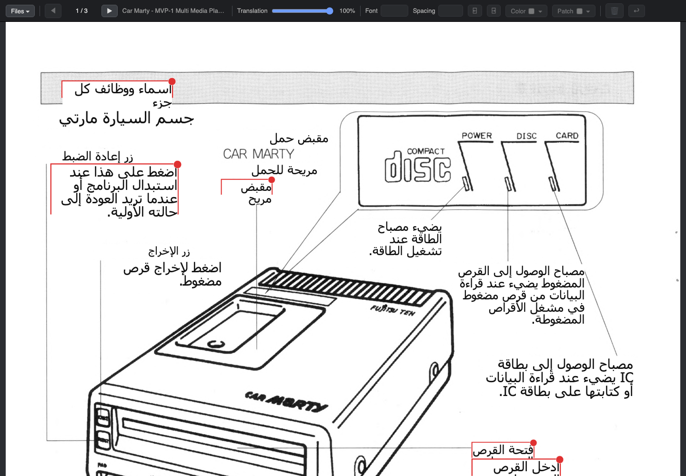

<div dir="rtl">

# مترجم الصور الممسوحة ضوئيًا

[English](readme.md) · **عربي**

حوّل الصفحات الممسوحة ضوئيًا — أدلة الاستخدام والكتيبات وأوراق المواصفات —
إلى صفحات مترجمة **تحافظ على شكل الأصل تمامًا**. يقرأ البرنامج النص الأصلي
بالتعرف الضوئي، ويترجمه، ثم يعيد كتابة الترجمة فوق الصورة نفسها، مع بقاء
الجداول والرسوم والأيقونات والشعارات في أماكنها. ويمكنك بعد ذلك إذا أردت تعديل النتيجة
في محرر مرئي على المتصفح.

تخيّله مثل وضع الكاميرا في ترجمة Google، لكن بالدقة الكاملة، مع حرية تحرير النصوص المترجمة، والعمل دون اتصال إنترنت على جهاز Mac.

<div dir="ltr">



</div>

*دليل ياباني مُترجَم تلقائيًا إلى العربية — مع بقاء التخطيط والجداول
والرسوم كما هي.*

## ماذا يستطيع أن يفعل

- **قراءة أكثر من ٣٠ لغة** عبر محرك Vision للتعرف الضوئي في macOS.
- **الترجمة دون اتصال** بمترجم Apple المدمج (macOS 15+)، أو عبر
  Google Cloud Translation — بما في ذلك اللغات اليمينية مثل العربية،
  بتشكيل ومحاذاة صحيحين.
- **تحرير النصوص في المتصفح**: انشئ وحرّر كتل النص وغيّر مواقعها وأحجامها وألوانها،
  التقط ألوان خلفية النصوص من الصورة نفسها. 
  التطبيق يعتمد مبدأ WYSIWYG أي أن ما تراه هو ما يُحفَظ حرفيًا.
- **احفظ الصور كصور أو وثائق**: الصور بصيغة PNG ملونة أو رمادية أو أبيض
  وأسود، أو بصيغة JPEG — أو وثائق **PDF مع طبقة نص مخفية قابلة للبحث**.
- **معالجة كتاب كامل دفعة واحدة** من سطر الأوامر أو الواجهة الرسومية؛ كل صفحة تُخزَّن
  مؤقتًا.

## التثبيت

يتطلب macOS 15 أو أحدث وأدوات سطر أوامر Xcode
(نفّذ `xcode-select --install` إن لم تكن مثبتة).

<div dir="ltr">

```bash
git clone https://github.com/techana/scanned-images-translator.git
cd scanned-images-translator

# اعتماديات بايثون
pip3 install pillow numpy pymupdf reportlab

# بناء المساعدَين الصغيرين بلغة Swift (مرة واحدة)
swiftc -O -o ocr ocr.swift
swiftc -O -o translate translate.swift
```

</div>

هذا كل شيء. للترجمة دون اتصال سيعرض macOS تنزيل حزمة اللغات لزوج
لغتك عند أول استخدام (مرة واحدة، ثم تعمل بلا إنترنت).

## الاستخدام

**المحرر:**

<div dir="ltr">

```bash
python3 gui.py
```

</div>

يفتح التطبيق في متصفحك. من **Files ▾ ← Load a folder…** اختر مجلد
الصفحات، وستُتَرجم كل صفحة عند عرضها. انقر أي كتلة نص لتعديلها؛ واسحب
شريط *Translation* لرؤية الأصل تحتها. **⌘S** يحفظ الصفحة — الحفظ الأول
يسألك عن المكان والصيغة ثم يتذكر اختيارك.

اللغات ومحرك الترجمة في **Files ▾ ← Settings…**

**سطر الأوامر** لمعالجة مجلدات كاملة:

<div dir="ltr">

```bash
python3 translate_pages.py scans/                          # ياباني ← إنجليزي
python3 translate_pages.py --source ja-JP --target ar scans/   # ← عربي
```

</div>

تُحفَظ النتائج بجوار المدخلات باسم `<page>_<language>.png`.

## جدير بالمعرفة

- نتائج التعرف الضوئي والترجمة تُخزَّن لكل صفحة في `.cache/` — وتعديلاتك
  محفوظة هناك أيضًا، وإعادة رسم كتاب كامل تستغرق ثوانيَ.
- الأمران `./ocr --list-langs` و`./translate --list-langs` يعرضان كل
  اللغات التي يدعمها جهازك.
- أخطاء التعرف الضوئي المتكررة في مستند معيّن تُصحَّح مرة واحدة بملف
  تصحيحات صغير (انظر المثال `fixes-carmarty.json` ومرّره بـ `--fixes`).

## الترخيص

MIT

</div>
