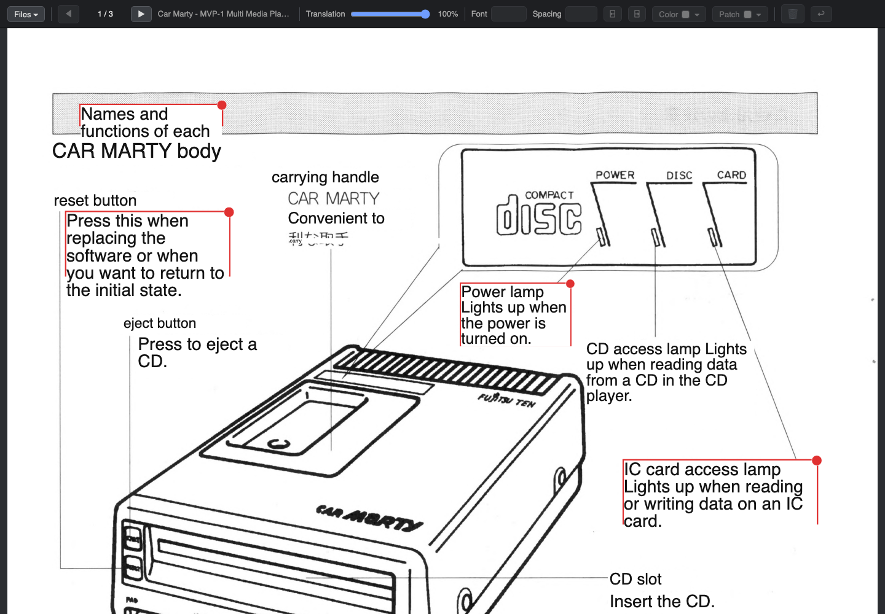

# Images Translator

**English** · [عربي](readme-ar.md)

Turn scanned pages — manuals, brochures, spec sheets — into translated
pages that still *look like the original*. The tool reads the text with
OCR, translates it, and redraws the translation right on top of the scan,
keeping the tables, diagrams, icons and logos exactly where they were.
Then you fine-tune the result in a visual editor.

Think of it as Google Translate's camera mode, but full-resolution,
editable, scriptable, and able to run 100% offline on your Mac.



*A Japanese manual, automatically translated to English — layout, tables
and artwork untouched.*

## What it can do

- **Read 30+ languages** using the macOS Vision OCR engine.
- **Translate offline** with Apple's built-in translator (macOS 15+), or
  through Google Cloud Translation — including right-to-left targets like
  Arabic, with correct shaping and alignment.
- **Edit everything visually** in your browser: move, resize and rewrite
  text boxes, change fonts, colors and backgrounds, pick a patch color
  straight from the image, undo with ⌘Z. What you see is exactly what
  gets saved.
- **Save the way you want**: PNG, optimized PNG-8, grayscale, crisp 1-bit
  black & white, JPEG — or a per-page **PDF with a hidden, searchable
  text layer**.
- **Batch a whole book** from the command line; every page is cached, so
  re-runs take seconds.

## Samples

Pages of a 1990s Japanese car-manual, straight out of the tool.

Example 1:

- [Original scanned page (Japanese)](docs/example_page_org.jpg)
- [Translated to English — PDF with a searchable text layer](docs/example_page_en.pdf)
- [Translated to Arabic — optimized PNG-8](docs/example_page_ar.png)

Example 2:

- [Original scanned page (Japanese)](docs/example2_page_org.jpg)
- [Translated to English — optimized PNG-8](docs/example2_page_en.png)

## Installation

Requires macOS 15 or newer and the Xcode Command Line Tools
(`xcode-select --install` if you don't have them).

```bash
git clone https://github.com/techana/scanned-images-translator.git
cd scanned-images-translator

# Python dependencies
pip3 install pillow numpy pymupdf reportlab

# build the two small Swift helpers (one time)
swiftc -O -o ocr ocr.swift
swiftc -O -o translate translate.swift
```

That's it. For offline translation, macOS will offer to download the
language pack for your language pair on first use (one time, then it
works without internet).

## Using it

**The editor:**

```bash
python3 gui.py
```

Your browser opens the app. **Files ▾ → Load a folder…**, pick your
scans, and pages translate as you view them. Click any text box to
adjust it; drag the *Translation* slider to peek at the original
underneath. **⌘S** saves the page — the first save asks where and in
which format, and remembers your answer.

Languages and the translation engine live in **Files ▾ → Settings…**

**The command line**, for whole folders at once:

```bash
python3 translate_pages.py scans/                          # Japanese → English
python3 translate_pages.py --source ja-JP --target ar scans/   # → Arabic
```

Output lands next to the inputs as `<page>_<language>.png`.

## Good to know

- OCR and translation results are cached per page in `.cache/` — edits
  live there too, and re-rendering a full book takes seconds.
- `./ocr --list-langs` and `./translate --list-langs` show every language
  your machine supports.
- Recurring OCR mistakes in a specific document can be fixed once with a
  small corrections file (see `fixes-carmarty.json` for an example, and
  pass it with `--fixes`).

## License

MIT
